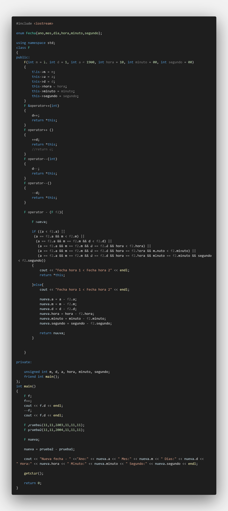

# Punto de Control 06

## :copyright: Serlio Giron

- :camera: 

- :technologist: **Serlio Giron**
- :e-mail: gironserlio@gmail.com
- :link: [https://github.com/SerlioGiron](https://github.com/SerlioGiron)
<!-- - :calendar: 
  - 2020-08-27 23:00 CST
  - 2021-02-24 13:09 CST -->

---

## :white_circle: static_cast type (variable)

## Codigo: 

## Salida: 

---

## :white_circle: static_cast vs dynamic_cast 1/3

## Codigo: 

## Salida: 

---

## :white_circle: static_cast vs dynamic_cast 2/3

## Codigo: 

## Salida: 

---

## :white_circle: static_cast vs dynamic_cast 3/3

## Codigo: 

## Salida: 

---

## :white_circle: Funciones Virtuales

## Codigo: 

## Salida: 

---

## :white_circle: typeid

## Codigo: 

## Salida: 

---

## :white_circle: Sobrecarga de operadores

## Codigo: 

## Salida: 

---

## :white_circle: Ejercicio 2, 3, 4 y 5

## Codigo: 

## Salida: 

---# Tarea-punto-de-control-06
